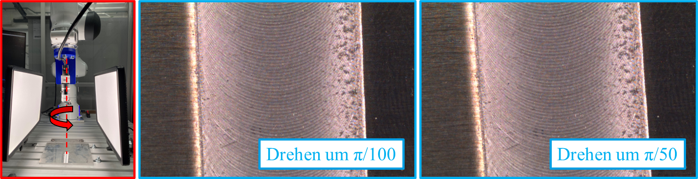
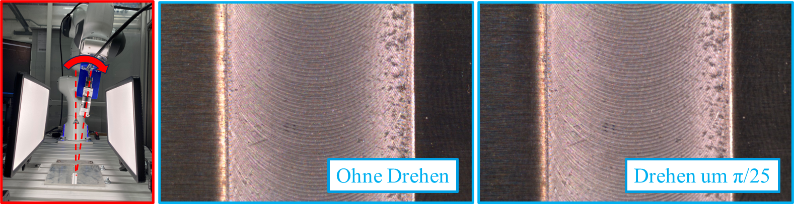

# Qualitätüberwachung via Deep-Learning-Verfahren

Ziel: Qualitätüberwachung der Schweißnaht via Deep-Learning-Verfahren in der Betrachtung von Gratbildung (Klassifizierungsproblem)

Die Robustheit des Modells wird durch bestehende Benchmark bewertet. Testdaten für Benchmark wird via PandaRoboter bereitgestellt, mehr bitte [PandaRobot-motion-planning](https://github.com/Shaoxiang2021/PandaRobot-motion-planning) anschauen.

1. Gesammelte Bilddaten labeln
2. Trainingsdaten Vorverarbeiten
3. Trainingsprozess
4. Validierung
5. Bewertung der Robustheit

Die Trainingspipeline ist entwickelt via Pytorch. 

## Table of contents   
- [(1) Environment](#(1)-Environment) 
- [(2) Software Structure](#(2)-Software-Structure) 
- [(3) Run The Software](#(3)-Run-The-Software)
- [(4) Benchmark](#(3)-Benchmark)

## (1) Environment

1. First, you need to download and install Conda. Both Miniconda and Anaconda are suitable options for this. More you can see: https://www.anaconda.com/. For example in Linux: 
    ```
    bash Miniconda3-latest-Linux-x86_64.sh
    ```

2. Install Pytorch, torchvision and sklearn. More you can see: https://pytorch.org/get-started/locally/

## (2) Software Structure

```
project
│   README.md
│
└───src
│   - dataset.py
│   - label_manager.py
│   - model.py
│   - pytorchtools.py
│   - train.py
│   
└─────
```

- `dataset.py`: Trainingsdaten und Validierungsdaten bereitstellen, Data-Augmentation <br />
- `label_manager.py`: manuell labeln <br />
- `model.py`: verschiedene Modelle aufladen <br />
- `pytorchtools.py`: Trainingstechnik earlystopping <br />
- `train.py`: Training, Validierung, Evaluation

## (3) Running the Software

Um Trainingspipeline effizient aufzubauen, wird die Funktionen in .ipynb debug und getestet. Training und Evaluation werden via main.ipynb implementiert. 

[(back to top)](#table-of-contents)

## (4) Benchmark

Aktuell verwenden meist Benchmarks für Bewertung der Robustheit künstlich Daten. In meiner Arbeit wird natürliche Daten verwendet, die durch Panda-Roboter bei den natürlichen Bedingungen gesammelt werden.

<div align="center">
    
    
<div>

## Authors
Shaoxiang Tan (ge28kiw@tum.de)
